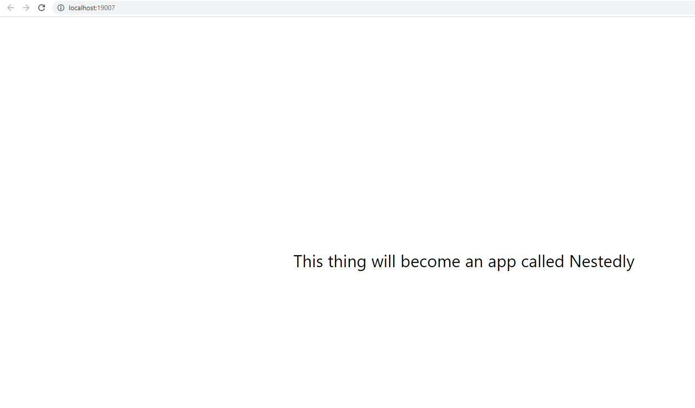

totally not a contactually clone
## Instructions to Run Server
1. nodemon server.js
1. in a browser, type localhost:3001/api/contacts
1. To add a contact, hit http://localhost:3001/api/testCreateContact
1. To add a nest, hit http://localhost:3001/api/testCreateNest


## Instructions to Run Client on MacOS.
1. download the "Expo Client" app from Play store/App store & signup/Login with email/pw
1. git clone + cd into the nestedly folder & do "npm install"
1. in powershell (can't be Git Bash), type: "expo login" and put in your expo email/pw from step 1:

PS C:\Users\alex\source\repos\nestedly> expo login                                                       
```js
┌─────────────────────────────────────────────────────────────────────────┐
│                                                                         │
│   There is a new version of expo-cli available (4.0.15).                │
│   You are currently using expo-cli 4.0.13                               │
│   Install expo-cli globally using the package manager of your choice;   │
│   for example: `npm install -g expo-cli` to get the latest version      │
│                                                                         │
└─────────────────────────────────────────────────────────────────────────┘
√ Username/Email Address: ... alex[censored]@gmail.com
√ Password: ... ************

Success. You are now logged in as [censored].
```

4. finally, type "npm start", and once the QR code screen pops up, you should be able to view the app either in (1) your EXPO CLIENT in iOS, or (2) in the web browser, or (3) android. 

### As of writing (2020-12-19), this setup doesn't build on iOS, but Works on android, and the web browser:

